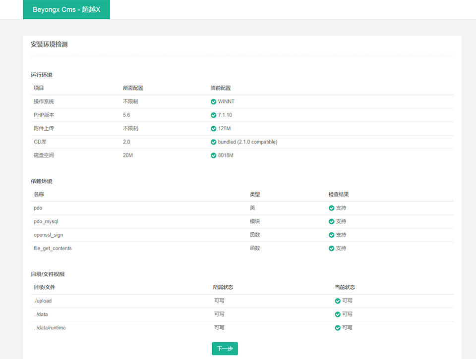
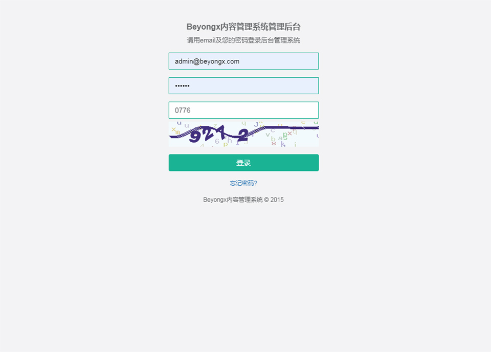
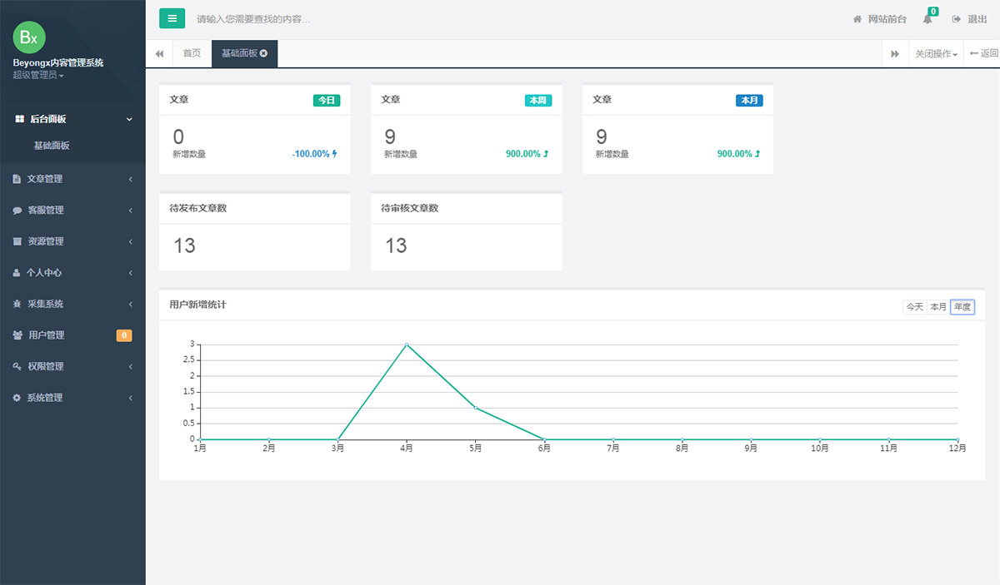

BeyongCms内容管理系统(简称BeyongCms)
===============

BeyongCms系统基于ThinkPHP5.1框架的轻量级内容管理系统，适用于企业Cms, 个人站长等，针对移动App、小程序优化；提供完善简洁的项目文档，方便开发人员进行二次开发。
支持模块式开发，方便平台扩展及第三方进行二次开发。专注于个人站长、中小企业客户，提供基础平台功能及丰富的应用扩展，
支持PC和移动场景，满足企业建站系统、后台管理框架、App后台开发、微信小程序开发、小程序开发框架、小程序API、小程序开发等实际二次开发场景。
其主要特性包括：

 + 基于PHP最流行的ThinkPHP5.1框架，web端采用jquery+bootstrap框架
 + 用户系统，邮箱、手机注册|登录支持
 + 文章系统，文章栏目管理、评论审核管理
 + 灵活的角色权限控制，RBAC管理
 + crontab定时任务;window下使用计划任务；linux下使用crontab
 + 主题系统;支持主题自定义开发；主题切换等
 + 插件系统
 + 站长特性支持，友链管理，Sitemap地图，收录检测，相关推荐，热门推荐等
 + 默认Composer第三方库支持，PHPQuery,think-queue
 + Swoole和Swoole协程支持
 + 针对App及小程序的api优化
 + 阿里云和七牛云OSS支持
 + 支持文章全文检索(开发中，支持ElasticSearch)
 
支持官网: https://www.beyongcms.com
交流QQ群1： 60916041

> ThinkPHP5.1的运行环境要求PHP7.0及以上。

##软件架构

系统支持Linux/Window/Mac OS三大平台；
软件架构采用nginx/apache + PHP + Mysql(MariaDB) [+redis] 的经典WEB架构，因为简单易于理解，且方便部署，门槛低；
理论上可支持SQL server, Oracle, Postgre SQL, MongoDB等，但未经充分测试。

## 安装教程

### 前期准备
准备好您的域名，并设置好指向；
安装apache/nginx, php及Mysql；
创建数据库，并分配数据库帐号密码（不建议用root），当前BeyongCms不支持帮助用户创建数据库；

### 自动安装引导

删除data/install.lock文件，如果存在的话；
浏览器中输入: http://your_domain;

### 管理后台

浏览器输入: http://your_domain/admin

### 站点SEO优化配置

后台进入 系统管理 -> 系统配置 -> SEO配置

### 启动定时及消息队列

修改config/queue.config文件
'default' => 'cms:queue',
改为
'default' => 'cms:queue:your_project',
避免如果你安装多份的BeyongCms导致的消息冲突;

Window下
>start_queue.bat
>start_timer.bat

Linux下
>sh start_queue.sh
>sh start_timer.bat

### Swoole模式的启动方式

Window下
>start_swoole.bat

Linux下
>start_swoole.sh 

系统的目录结构如下：

~~~
POROJECT_NAME  WEB部署目录（或者子目录）
|-─addons                附加插件
├─application           应用目录
│  ├─admin             管理后模块
│  ├─common            公共模块
│  ├─cms               CMS模块，站点及官网前端
│  └─install           自动安装向导
├─config                应用配置目录
├─data                  数据存储目录(资源数据，安装数据，临时数据，备份数据)
│  ├─assets            资源数据
│  ├─backup            备份数据
│  ├─install           安装数据及配置数据
│  └─runtime           临时数据（ThinkPHP的runtime目录移到这）
├─extend                扩展目录（一些常用的库--非composer库）
├─route                 路由定义目录
│  ├─cms.php           Cms模块的路由定义（优化搜索引擎收录）
│  └─route.php.        通用的路由定义
├─public                WEB目录（对外访问目录）
│  ├─static            全局静态文件（img,css,js,fonts）
│  ├─theme             主题模板目录
│    ├─classic          主题目录(主题名称:classic)
|       ├─static        静态文件夹(img,css,js,fonts)
|       ├─tpl           主题View前端模板
│       ├─Layui.php       Paginator分页类(名称自定义)
│       ├─paginate.php    paginate配置文件
│       └─theme.php       theme配置信息（包含自适应，文章图片，广告图配置）
|    ├─ .....           其他模板
│  ├─upload            上传目录（图片、文件、ueditor上传目录）
│  ├─index.php         入口文件
│  ├─router.php        快速测试文件
│  └─.htaccess         用于apache的重写
├─check_env.sh          Linux权限检测及调整脚本
├─start_queue.bat       Window消息队列启动脚本
├─start_queue.sh        Linux消息队列启动脚本
├─start_swoole.bat      Window Swoole启动脚本(使用了swoole官方的cygwin)
├─start_swoole.sh       Linux swoole启动脚本
├─start_timer.bat       Window定时启动脚本（增加执行计划）
├─start_timer.sh        Linux定时启动脚本（添加crontab）
~~~

